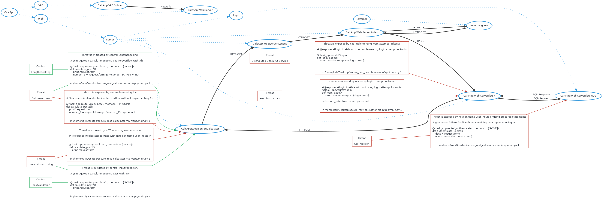

# Threatspec Project Threat Model

A threatspec project.


# Diagram



# Exposures


# Acceptances


# Transfers


# Mitigations


# Reviews


# Connections

## External:guest To CalcApp:Web:Server:Index
HTTP-GET

```
# @connects #guest to #index with HTTP-GET
@flask_app.route('/')
def index_page():
    print(request.headers)
    isUserLoggedIn = False
    if 'token' in request.cookies:

```
/home/kali/Desktop/secure_rest_calculator-main/app/main.py:1

## External:guest To CalcApp:Web:Server:Calculator
HTTP-GET

```
# @connects #guest to #calculator with HTTP-GET
@flask_app.route('/calculator', methods = ['GET'])
def calculator_get():
    isUserLoggedIn = False
    if 'token' in request.cookies:
        isUserLoggedIn = verify_token(request.cookies['token'])

```
/home/kali/Desktop/secure_rest_calculator-main/app/main.py:1

## External:guest To CalcApp:Web:Server:Logout
HTTP-GET

```
# @connects #guest to #logout with HTTP-GET
@flask_app.route('/logout', methods = ['GET'])
def logout():
    response = make_response(redirect('/'))
    response.delete_cookie('token')
    return response

```
/home/kali/Desktop/secure_rest_calculator-main/app/main.py:1

## CalcApp:VPC:Subnet To CalcApp:Web:Server
Network

```
# @connects #subnet to #web_server with Network
resource "aws_instance" "cyber94_calculator2_asaleh_webserver_tf" {
    ami = var.var_aws_ami_ubuntu_1804
    instance_type = "t2.micro"
    subnet_id = var.var_web_subnet_id
    associate_public_ip_address = true

```
/home/kali/Desktop/secure_rest_calculator-main/Terraform-infra-modular/modules/webserver/main.tf:1


# Components

## External:guest

## CalcApp:Web:Server:Index

## CalcApp:Web:Server:Calculator

## CalcApp:Web:Server:Logout

## CalcApp:VPC:Subnet

## CalcApp:Web:Server


# Threats


# Controls
